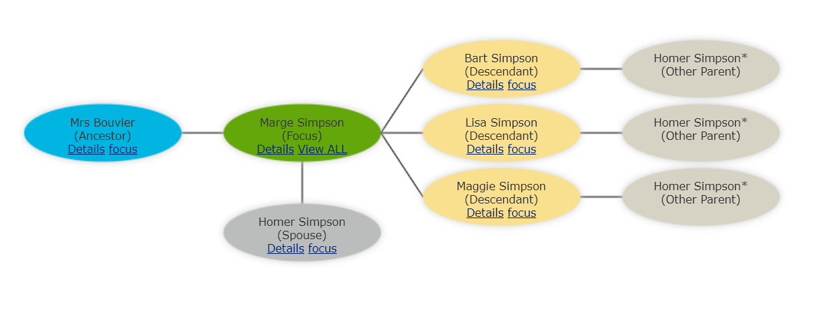

# family-tree-viz
Convert a CSV family tree table into a visualization.

- [Sample Data with Simpsons Characters](data.csv)
- [Sample Data with Simpsons Characters as YAML file](data.yml)
- [Sample Data with Simpsons Characters in indented YAML file](indented.yml)

- [Demo: data.csv](https://georgetown-university-libraries.github.io/family-tree-viz/?doc=data.csv)
- [Demo: data.yml](https://georgetown-university-libraries.github.io/family-tree-viz/?doc=data.yml)
- [Demo: indented.yml](https://georgetown-university-libraries.github.io/family-tree-viz/?doc=indented.yml)
- [Demo with 75 people: big.yml](https://georgetown-university-libraries.github.io/family-tree-viz/?doc=big.yml)

## Credits

### Visualization
This is built with the InfoVis toolkit: http://philogb.github.io/infovis using the Spacetree visualization: https://philogb.github.io/jit/static/v20/Jit/Examples/Spacetree/example1.html

### Yaml Processing
This code uses js-yaml.js.  https://github.com/nodeca/js-yaml

The following link provides a great tool for validating Yaml: http://nodeca.github.io/js-yaml/
